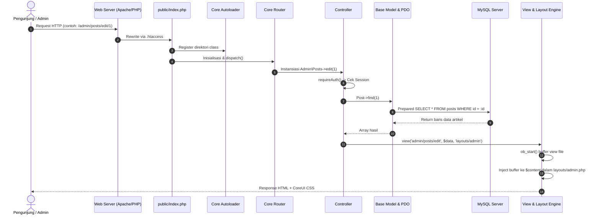
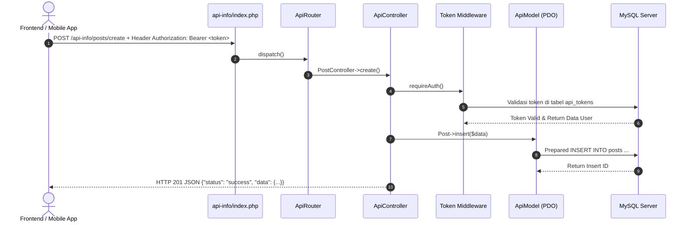

# 🏛️ Arsitektur Teknis MyFrameWork

Dokumen ini menjelaskan arsitektur internal, pola desain (*design patterns*), dan alur eksekusi request pada **MyFrameWork**.

---

## 1. Pola Desain (Design Patterns)

Framework ini dirancang tanpa Composer (*zero-dependency*), dengan mengadopsi pola-pola standar industri:

1. **Front Controller Pattern**:
   - Web CMS: `public/index.php` bertindak sebagai pintu masuk tunggal (*single point of entry*).
   - REST API: `api-info/index.php` bertindak sebagai entrypoint terpisah.
2. **Convention over Configuration (CoC)**:
   - Pemetaan URL `/{controller}/{method}/{param1}` otomatis mengarah ke file class dan method terkait tanpa perlu mendaftar route manual.
3. **Singleton Pattern**:
   - `Database::getConnection()` dan `ApiDatabase::getConnection()` menjamin hanya ada 1 koneksi PDO aktif per request lifecycle.
4. **Model-View-Controller (MVC)**:
   - Pemisahan ketat antara data layer (Model), alur logika bisnis (Controller), dan representasi antarmuka (View).
5. **Template View with Output Buffering**:
   - Menggunakan buffer memori internal PHP (`ob_start()`, `ob_get_clean()`) untuk menginjeksi view spesifik ke dalam master layout modular.
6. **Headless Decoupled Architecture**:
   - Web CMS beroperasi 100% sebagai consumer REST API via `core/ApiClient.php`. Tidak ada controller yang mengakses database langsung.

---

## 2. Diagram Arsitektur Headless CMS & REST API

```mermaid
flowchart TD
    subgraph Frontend["CMS Web Application (Zero Database Access)"]
        A["Pengunjung (Portal Berita)"] -->|HTTP Request| AC["core/ApiClient.php"]
        B["Halaman Login (/auth/login)"] -->|POST /auth/login| AC
        C["Admin Dashboard (/admin/*)"] -->|Bearer Token API| AC
    end

    subgraph BackendAPI["Standalone REST API Engine (api-info/)"]
        AC -->|JSON API Requests| R["api-info/core/ApiRouter.php"]
        R --> C1["AuthController"]
        R --> C2["DashboardController"]
        R --> C3["PostController"]
        R --> C4["CategoryController"]
        R --> C5["MediaController"]
        R --> C6["SettingController"]
    end

    subgraph Storage["Database Server"]
        BackendAPI -->|PDO Connection (api-info/core/ApiDatabase.php)| DB[("MySQL / MariaDB Database")]
    end
```

---

## 3. Alur Eksekusi Web CMS Utama



---

## 3. Alur Eksekusi Standalone REST API (`api-info/`)

Aplikasi `api-info/` sepenuhnya independen dari web utama:



---

## 4. Mekanisme Subfolder Admin Routing

Logika resolusi URL pada `core/Router.php`:

```text
URL: /admin/posts/edit/5
 ├── Segmen 0: 'admin'        -> Tetapkan subfolder 'admin/'
 ├── Segmen 1: 'posts'        -> Controller: 'Posts' (file: app/controllers/admin/Posts.php)
 ├── Segmen 2: 'edit'         -> Method: 'edit()'
 └── Segmen 3+: ['5']         -> Parameter dipassing via call_user_func_array
```

Jika URL hanya `/admin`, otomatis memanggil controller default `Dashboard` dengan method `index()`.
Jika URL publik biasa (misal `/post/read/slug-1`), memanggil `app/controllers/Post.php` method `read('slug-1')`.

---

## 5. Keamanan Sistem (Security Measures)

- **SQL Injection**: Seluruh query data wajib melewati PDO Prepared Statements dengan parameter binding (`:param`).
- **Cross-Site Scripting (XSS)**: Setiap output variabel ke HTML wajib disanitasi menggunakan fungsi helper `e($string)` yang membungkus `htmlspecialchars($str, ENT_QUOTES, 'UTF-8')`.
- **Cross-Site Request Forgery (CSRF)**: Seluruh formulir web wajib menyertakan token CSRF melalui `<?= csrf_field() ?>`, yang divalidasi oleh `Request::validateCsrf()` di Controller.
- **Brute Force & Hash Password**: Menggunakan algoritma kriptografi satu arah `PASSWORD_BCRYPT` bawaan PHP dengan salt dinamis.
