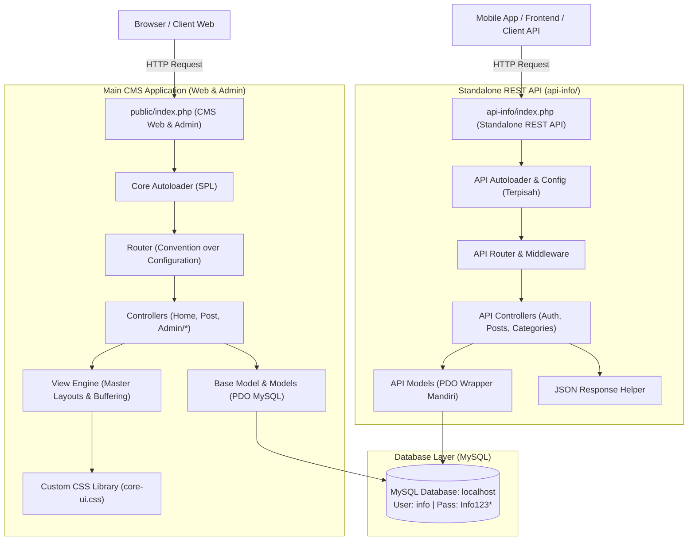

# Rencana Implementasi: Framework PHP MVC untuk CMS & Standalone REST API

Dokumen ini merangkum hasil wawancara interaktif (`/grill-me`) dan spesifikasi arsitektur teknis untuk pembuatan kerangka framework baru CMS berbasis PHP MVC murni tanpa dependensi eksternal (zero-dependency).

---

## 1. Ikhtisar Arsitektur



---

## 2. Struktur Direktori Proyek

```
myFrameWork/
├── app/                              # Aplikasi Utama (CMS Web & Admin)
│   ├── config/
│   │   ├── app.php                   # Konfigurasi aplikasi, base_url, default controller
│   │   └── database.php              # Konfigurasi koneksi MySQL (localhost, info, Info123*)
│   ├── controllers/
│   │   ├── Home.php                  # Controller publik: Halaman Utama
│   │   ├── Post.php                  # Controller publik: Baca artikel (/post/read/slug)
│   │   ├── Auth.php                  # Controller auth: Login & Logout
│   │   └── admin/                    # Subfolder Controller khusus Admin Panel
│   │       ├── Dashboard.php         # /admin/dashboard
│   │       ├── Posts.php             # /admin/posts (CRUD Artikel)
│   │       ├── Categories.php        # /admin/categories (CRUD Kategori)
│   │       ├── Media.php             # /admin/media (Upload & Manajemen File)
│   │       └── Settings.php          # /admin/settings (Pengaturan Situs)
│   ├── models/
│   │   ├── User.php                  # Model pengguna & autentikasi
│   │   ├── Post.php                  # Model artikel & halaman
│   │   ├── Category.php              # Model kategori
│   │   ├── Media.php                 # Model file media
│   │   └── Setting.php               # Model pengaturan website
│   └── views/
│       ├── layouts/
│       │   ├── frontend.php          # Master layout untuk portal publik
│       │   ├── admin.php             # Master layout dashboard admin
│       │   └── auth.php              # Master layout login / auth
│       ├── home/
│       │   └── index.php
│       ├── post/
│       │   └── read.php
│       ├── auth/
│       │   └── login.php
│       └── admin/
│           ├── dashboard/index.php
│           ├── posts/index.php, create.php, edit.php
│           ├── categories/index.php
│           ├── media/index.php
│           └── settings/index.php
├── core/                             # Engine Inti Framework (Zero-dependency)
│   ├── Autoloader.php                # SPL Autoloader otomatis
│   ├── Router.php                    # Convention Router /{controller}/{method}/{param} & /admin/*
│   ├── Controller.php                # Base Controller (view, model, redirect, json, session, auth check)
│   ├── Model.php                     # Base Model (PDO CRUD: find, all, insert, update, delete, query)
│   ├── Database.php                  # Singleton PDO Connection Manager
│   ├── Request.php                   # Sanitasi input, get, post, files, method check
│   ├── Response.php                  # Response status header & redirect
│   ├── Session.php                   # Session flash messages, auth session
│   └── Helper.php                    # Fungsi bantu: e() XSS sanitization, base_url(), asset(), slugify()
├── public/                           # Web Root Publik (CMS Web)
│   ├── index.php                     # Front controller utama
│   ├── .htaccess                     # URL Rewrite Apache
│   ├── uploads/                      # Direktori upload media/gambar
│   └── assets/
│       ├── css/
│       │   └── core-ui.css           # CUSTOM CSS LIBRARY LENGKAP (100% Buatan Sendiri)
│       └── js/
│           └── core-ui.js            # Micro JS helper (modal, sidebar toggle, alert dismiss)
├── database/
│   ├── schema.sql                    # Skema tabel MySQL lengkap
│   └── seeder.sql                    # Data akun admin awal & konten sampel
├── api-info/                         # APLIKASI REST API TERPISAH
│   ├── config/
│   │   ├── app.php                   # Konfigurasi REST API
│   │   └── database.php              # Konfigurasi koneksi MySQL terpisah
│   ├── core/
│   │   ├── ApiAutoloader.php         # Autoloader mandiri api-info
│   │   ├── ApiRouter.php             # Convention & pattern router untuk API
│   │   ├── ApiController.php         # Base controller API (format JSON, Auth token check)
│   │   └── ApiDatabase.php           # PDO connection terpisah
│   ├── controllers/
│   │   ├── AuthController.php        # POST /auth/login -> return Bearer token
│   │   ├── PostController.php        # GET /post, GET /post/{id}, POST /post, PUT, DELETE
│   │   ├── CategoryController.php    # GET /category, POST, PUT, DELETE
│   │   └── SettingController.php     # GET /setting
│   ├── models/
│   │   ├── ApiPost.php
│   │   ├── ApiCategory.php
│   │   ├── ApiUser.php
│   │   └── ApiSetting.php
│   ├── index.php                     # Entrypoint mandiri untuk REST API
│   └── .htaccess                     # Rewrite untuk REST API
└── README.md                         # Panduan instalasi dan dokumentasi penggunaan
```

---

## 3. Komponen Utama Framework

### A. Core Engine Murni
- **`Autoloader`**: Memetakan namespace atau class path (`core/`, `app/controllers/`, `app/models/`) otomatis via `spl_autoload_register`.
- **`Router`**:
  - Konvensi URL: `/{controller}/{method}/{param1}/{param2}`
  - Subfolder Admin: `/admin/{controller}/{method}/{param1}` langsung memanggil file di `app/controllers/admin/`
  - URL fallback: Jika controller tidak diberikan, memanggil `Home->index()`. Jika method tidak diberikan, memanggil `index()`.
- **`Model`**:
  - CRUD helper bawaan: `find($id)`, `all($orderBy)`, `insert($data)`, `update($id, $data)`, `delete($id)`, `where($column, $value)`, `count()`.
  - Method `query($sql, $params)` untuk prepared statements custom yang aman dari SQL Injection.
- **`View Engine`**:
  - Menggunakan output buffering (`ob_start()`, `ob_get_clean()`).
  - View konten disuntikkan ke variabel `$content` di dalam master layout `frontend.php` atau `admin.php`.

### B. Custom CSS Library Internal (`core-ui.css`)
Dibangun murni dari nol tanpa Tailwind / Bootstrap / CDN pihak ketiga:
- **Design Tokens**: Modern color palette (Primary Indigo/Blue, Success Emerald, Danger Rose, Slate Neutrals), border-radius, shadows.
- **Layout & Grid**: Flexbox utilities, container, responsive grid (1-12 cols).
- **Komponen Admin**:
  - Sidebar responsif dengan link aktif dan badge.
  - Top header bar dengan user dropdown dan profil.
  - Stat cards (counter metrik dengan indikator visual).
  - Data table yang rapi, hover state, zebra striping, dan responsive wrapper.
  - Form controls lengkap (input, select, textarea, switch, drag-and-drop file preview).
  - Buttons (primary, secondary, danger, success, outline) & Badges (pill status).
  - Alert notifications (flash message success, error, warning).
  - Modal dialog native ringan.

### C. CMS Starter Scaffolding
- **Role & Autentikasi**: Login sesi aman dengan `password_hash()`, role `admin` dan `editor`.
- **Manajemen Artikel**: CRUD artikel, auto slug generation, status publish/draft, kategori, thumbnail.
- **Manajemen Kategori**: CRUD kategori artikel/halaman.
- **Media Manager**: Upload gambar dengan sanitasi nama file, validasi ekstensi (`jpg, jpeg, png, gif, webp, pdf`), preview galeri.
- **Site Settings**: Simpan konfigurasi situs (Site Title, Tagline, Admin Email, Footer text).
- **Frontend Portal**: Tampilan portal berita/blog publik yang sudah terhubung dengan database dan responsive.

### D. Standalone REST API (`api-info/`)
- Memiliki entry point dan konfigurasi mandiri di dalam folder `api-info/`.
- Respon seragam berstandar JSON:
  ```json
  {
    "status": "success",
    "code": 200,
    "message": "Data retrieved successfully",
    "data": [ ... ],
    "meta": { "timestamp": 1727770000 }
  }
  ```
- Dukungan autentikasi berbasis Token (Bearer / X-API-KEY) untuk endpoint mutasi data (POST, PUT, DELETE).
- Endpoint siap pakai untuk Post, Category, Setting, dan Autentikasi token.

### E. Kredensial Database Bawaan
- **Host**: `localhost`
- **Username**: `info`
- **Password**: `Info123*`
- **Database**: `cms_framework`
- Disediakan file `database/schema.sql` dan `database/seeder.sql` (beserta skrip auto-installer cepat via PHP).

---

## 4. Langkah Pelaksanaan

1. **Pembuatan Struktur Direktori & Konfigurasi** (`core/`, `app/`, `public/`, `database/`, `api-info/`).
2. **Pembuatan Core Engine Framework** (`Autoloader`, `Router`, `Controller`, `Model`, `Database`, `Request`, `Response`, `Session`, `Helper`).
3. **Pembuatan Custom CSS Library & Micro JS** (`public/assets/css/core-ui.css`, `public/assets/js/core-ui.js`).
4. **Pembuatan Database Schema & Seeder** (`database/schema.sql`, default admin: `admin@cms.local` / `admin123`).
5. **Pembuatan Model & Controller CMS** (User, Post, Category, Media, Setting, Auth, Dashboard, Frontend).
6. **Pembuatan Master Layout & Views** (Frontend layout, Admin layout, Auth layout, dan view CRUD lengkap).
7. **Pembuatan Standalone REST API `api-info/`** (Config, Core, Router, Controller, Model, Response format, dan Token middleware).
8. **Pengujian & Verifikasi File** (Validasi sintaks PHP di setiap file, cek autoloader, pastikan tidak ada sintaks error).
9. **Dokumentasi Lengkap** (`README.md` dengan panduan menjalankan CMS dan REST API secara lokal via `php -S`).
